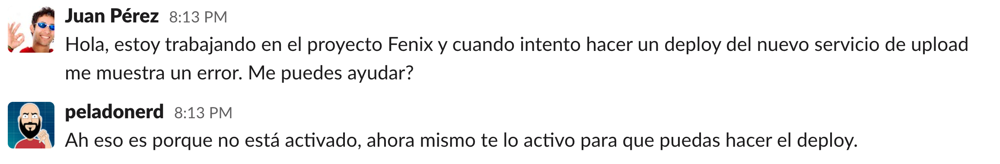

Si te mandaron a esta página, no lo tomes a mal. Es probable que quieras ser cordial al comunicarte, pero esto puede ser un problema. ¡Quiero que nuestra comunicación sea eficiente!

### Por favor no me digas "hola" en el chat.

Seguramente has hecho lo siguiente:

Es como si llamaras a alguien, le dijeras "Hola!" y lo pusieras en espera.

Por favor, haz esto mejor:

Como puedes ver, obtuviste tu respuesta mucho antes, y no hiciste esperar a nadie. En lugar de estar esperando, ¡tu compañero pudo empezar a responder apenas recibió tu mensaje!

Estás tratando de ser cordial al no saltar directamente a la pregunta que tienes, como si lo hicieras en persona o por teléfono. Pero el chat no es ninguna de esas cosas, tipear es mucho mas lento que hablar. En lugar de ser cordial, estás haciendo a la otra persona esperar a que tipees tu pregunta, lo que se traduce en pérdida de productividad.

Lo mismo con los siguientes ejemplos:

¡Directamente haz la pregunta!

Si sientes que solamente decir Hola y después hacer la pregunta es un poco brusco, puedes hacer lo siguiente:

Adicionalmente, hacer la pregunta antes de obtener una respuesta de tu compañero habilita la comunicación asíncrona. Si la otra persona no está presente en ese momento o no puede responder, y te vas antes de hacerle la pregunta, ellos pueden responder cuando puedan en lugar de quedarse preguntándose qué necesitabas.

Pasale esta página a aquellos compañeros que deberían aprender a comunicarse por chat :)

---

Esta página es una versión en español de la icónica [nohello.com](https://nohello.com).